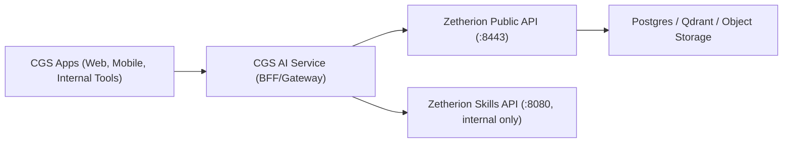
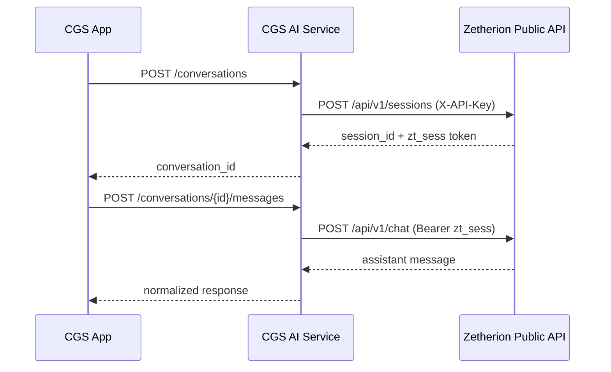

# CGS and Zetherion Integration Service Draft

Version: `v1.0-draft`  
Date: `2026-03-01`  
Owners: `Catalyst Group Solutions (CGS) Platform`, `Zetherion Backend`

Maintenance note (2026-03-04):
- Internal document route typing/multipart parsing hardening was applied.
- Public + gateway service contracts defined in this draft remain unchanged.
- Added tenant email admin control-plane routes under `/service/ai/v1/internal/admin/tenants/{tenant_id}/email/*` with step-up + approval requirements for high-risk actions.
- Zetherion-only boundary recovery removed in-repo CGS website/UI assets; integration contract remains CGS-only.

## 1. Purpose

This draft defines the service contract that lets CGS act as the API provider for company apps while Zetherion acts as the backend AI provider.

Goals:
- Give all CGS apps one stable AI API contract.
- Keep Zetherion tenant credentials server-side only.
- Support chat, streaming, analytics, and recommendation workflows now.
- Define internal tenant lifecycle and key rotation workflows.
- Define phase-gated CRM and reporting endpoints for company use.

Non-goals:
- Direct browser-to-Zetherion integration.
- Exposing Zetherion internal Skills API to external app clients.
- Any direct external use of Zetherion `/api/v1` without CGS.

## 2. Current State Audit Summary

Implemented in Zetherion now:
- Multi-tenant public API on `/api/v1` with sessions, chat, streaming, analytics, recommendations, release markers, and optional YouTube routes.
- API key and session token authentication split.
- Tenant/session isolation checks and per-tenant rate limiting.
- Tenant storage schema for chat, analytics, replay, recommendations, and CRM extraction tables.
- Client skills registered in internal Skills service: `client_provisioning`, `tenant_intelligence`, `client_insights`, `client_app_watcher`.

Important gaps for a company-wide CGS service:
- Tenant provisioning is internal workflow, not exposed on Zetherion public `/api/v1`.
- CRM read APIs are not broadly exposed on Zetherion public API yet.
- CORS settings are not wired from config/env in API `main()`, so browser-direct cross-origin is not the right path for now.
- No explicit idempotency key contract on Zetherion public endpoints.

## 3. Target Architecture



Design rule:
- Apps call CGS only.
- CGS calls Zetherion public API for runtime chat and analytics.
- CGS calls Zetherion Skills API for internal tenant lifecycle operations.

## 4. Auth and Security Model

### 4.1 App to CGS

- Auth: CGS standard app auth (`Authorization: Bearer <cgs_user_or_service_jwt>`).
- Tenant context: resolved by CGS from app identity + company mapping.
- Optional headers:
  - `X-Request-Id`
  - `Idempotency-Key` for retriable POSTs.

### 4.2 CGS to Zetherion Public API

- Session creation and release markers:
  - `X-API-Key: sk_live_...` (tenant-specific key in secure store).
- Session-scoped calls (chat, analytics):
  - `Authorization: Bearer zt_sess_...` (token returned by Zetherion session creation).

### 4.3 CGS to Zetherion Skills API (Internal Only)

- Auth: `X-API-Secret` configured between CGS internal worker and Zetherion Skills API.
- Use only for operator/internal workflows such as tenant create/configure/rotate/list.

### 4.4 Key Handling Rules

- Never expose Zetherion API keys or `zt_sess_` tokens to browsers.
- Store tenant API keys encrypted at rest in CGS secrets storage (KMS-backed).
- Keep key version metadata and rotate keys through internal endpoint.

## 5. API Contract for CGS AI Service

Base path (proposed): `/service/ai/v1`

Response envelope (all JSON endpoints):

```json
{
  "request_id": "req_01H...",
  "data": {},
  "error": null
}
```

Error envelope:

```json
{
  "request_id": "req_01H...",
  "data": null,
  "error": {
    "code": "AI_UPSTREAM_401",
    "message": "Session expired",
    "retryable": false,
    "details": {}
  }
}
```

## 6. Endpoint Catalog (CGS Service)

### 6.1 Runtime Endpoints (for all company apps)

| CGS Endpoint | Method | Purpose | Zetherion Upstream | Status |
|---|---|---|---|---|
| `/conversations` | `POST` | Create AI conversation/session | `POST /api/v1/sessions` | Ready |
| `/conversations/{conversation_id}` | `GET` | Conversation metadata | `GET /api/v1/sessions/{session_id}` | Ready |
| `/conversations/{conversation_id}` | `DELETE` | End/delete conversation | `DELETE /api/v1/sessions/{session_id}` | Ready |
| `/conversations/{conversation_id}/messages` | `POST` | Sync chat reply | `POST /api/v1/chat` | Ready |
| `/conversations/{conversation_id}/messages/stream` | `POST` | SSE chat stream | `POST /api/v1/chat/stream` | Ready |
| `/conversations/{conversation_id}/messages` | `GET` | Chat history | `GET /api/v1/chat/history` | Ready |
| `/conversations/{conversation_id}/analytics/events` | `POST` | Event batch ingest | `POST /api/v1/analytics/events` | Ready |
| `/conversations/{conversation_id}/analytics/replay/chunks` | `POST` | Replay chunk ingest | `POST /api/v1/analytics/replay/chunks` | Ready |
| `/conversations/{conversation_id}/analytics/replay/chunks/{web_session_id}/{sequence_no}` | `GET` | Replay chunk metadata/data | `GET /api/v1/analytics/replay/chunks/{web_session_id}/{sequence_no}` | Ready |
| `/conversations/{conversation_id}/analytics/end` | `POST` | End tracked session + summarize | `POST /api/v1/analytics/sessions/end` | Ready |
| `/conversations/{conversation_id}/recommendations` | `GET` | Session recommendations | `GET /api/v1/analytics/recommendations` | Ready |
| `/conversations/{conversation_id}/recommendations/{recommendation_id}/feedback` | `POST` | Feedback on recommendation | `POST /api/v1/analytics/recommendations/{recommendation_id}/feedback` | Ready |
| `/documents/uploads` | `POST` | Create tenant document upload intent | `POST /api/v1/documents/uploads` | Ready |
| `/documents/uploads/{upload_id}/complete` | `POST` | Complete tenant document upload | `POST /api/v1/documents/uploads/{upload_id}/complete` | Ready |
| `/documents` | `GET` | List tenant documents | `GET /api/v1/documents` | Ready |
| `/documents/{document_id}` | `GET` | Get tenant document metadata | `GET /api/v1/documents/{document_id}` | Ready |
| `/documents/{document_id}/preview` | `GET` | Inline document preview stream | `GET /api/v1/documents/{document_id}/preview` | Ready |
| `/documents/{document_id}/download` | `GET` | Raw document download stream | `GET /api/v1/documents/{document_id}/download` | Ready |
| `/documents/{document_id}/index` | `POST` | Re-index a tenant document | `POST /api/v1/documents/{document_id}/index` | Ready |
| `/rag/query` | `POST` | Query tenant vector store + generate answer | `POST /api/v1/rag/query` | Ready |
| `/models/providers` | `GET` | Retrieve provider/model catalog | `GET /api/v1/models/providers` | Ready |

### 6.2 Internal Operator Endpoints (CGS only)

| CGS Internal Endpoint | Method | Purpose | Upstream | Status |
|---|---|---|---|---|
| `/service/ai/v1/internal/tenants` | `GET` | List tenants | Skills `client_list` | Ready |
| `/service/ai/v1/internal/tenants` | `POST` | Create tenant + API key | Skills `client_create` | Ready |
| `/service/ai/v1/internal/tenants/{tenant_id}` | `PATCH` | Update tenant config | Skills `client_configure` | Ready |
| `/service/ai/v1/internal/tenants/{tenant_id}/deactivate` | `POST` | Deactivate tenant | Skills `client_deactivate` | Ready |
| `/service/ai/v1/internal/tenants/{tenant_id}/keys/rotate` | `POST` | Rotate tenant API key | Skills `client_rotate_key` | Ready |
| `/service/ai/v1/internal/tenants/{tenant_id}/release-markers` | `POST` | Publish deployment marker | `POST /api/v1/releases/markers` | Ready |

### 6.2A Internal Tenant Admin + Email Endpoints (CGS only)

Prefix: `/service/ai/v1/internal/admin/tenants/{tenant_id}`

Admin routes (existing):
- Discord users and role control
- Guild/channel bindings
- Settings and secrets
- Audit and approval queue

Email admin routes (google-first):
- `GET|PUT /email/providers/{provider}/oauth-app`
- `POST /email/mailboxes/connect/start`
- `GET /email/mailboxes/connect/callback`
- `GET /email/mailboxes`
- `PATCH|DELETE /email/mailboxes/{mailbox_id}`
- `POST /email/mailboxes/{mailbox_id}/sync`
- `GET /email/critical/messages`
- `GET /email/calendars`
- `PUT /email/mailboxes/{mailbox_id}/calendar-primary`
- `GET /email/insights`
- `POST /email/insights/reindex`

Security rules:
- Operator auth + `cgs:zetherion-admin` required.
- Mutating routes require step-up auth.
- OAuth app read/write additionally require `cgs:zetherion-secrets-admin`.
- OAuth app writes and mailbox disconnects require approved `change_ticket_id`.

### 6.3 Company Reporting Endpoints

| CGS Endpoint | Method | Purpose | Upstream | Status |
|---|---|---|---|---|
| `/tenants/{tenant_id}/crm/contacts` | `GET` | CRM contacts for tenant | `GET /api/v1/crm/contacts` | Ready |
| `/tenants/{tenant_id}/crm/interactions` | `GET` | CRM interactions for tenant | `GET /api/v1/crm/interactions` | Ready |
| `/tenants/{tenant_id}/analytics/funnel` | `GET` | Tenant funnel daily metrics | `GET /api/v1/analytics/funnel` | Ready |
| `/tenants/{tenant_id}/analytics/recommendations` | `GET` | Tenant-level recommendations | `GET /api/v1/analytics/recommendations/tenant` | Ready |

## 7. Detailed Endpoint Drafts

## 7.1 `POST /service/ai/v1/conversations`

Create a new conversation for an app user.

Auth:
- App auth token.

Headers:
- `Idempotency-Key` recommended.

Request:

```json
{
  "tenant_id": "uuid-or-cgs-tenant-slug",
  "app_user_id": "user_123",
  "external_user_id": "optional-external-id",
  "metadata": {
    "app": "portal",
    "channel": "web"
  }
}
```

CGS behavior:
- Resolve tenant mapping and fetch Zetherion API key.
- Call Zetherion `POST /api/v1/sessions` with `X-API-Key`.
- Store:
  - `conversation_id` (CGS ID),
  - `zetherion_session_id`,
  - `zt_sess_token` (encrypted),
  - tenant and user references.

Response:

```json
{
  "request_id": "req_...",
  "data": {
    "conversation_id": "cgs_conv_...",
    "tenant_id": "tenant_...",
    "session_id": "zetherion_session_uuid",
    "created_at": "2026-02-27T15:00:00Z",
    "expires_at": "2026-02-28T15:00:00Z"
  },
  "error": null
}
```

## 7.2 `GET /service/ai/v1/conversations/{conversation_id}`

Return metadata for one conversation.

CGS behavior:
- Load mapped Zetherion session.
- Optional refresh from `GET /api/v1/sessions/{session_id}` with `X-API-Key`.

## 7.3 `DELETE /service/ai/v1/conversations/{conversation_id}`

Delete/end one conversation.

CGS behavior:
- Call Zetherion `DELETE /api/v1/sessions/{session_id}`.
- Mark CGS conversation closed.

## 7.4 `POST /service/ai/v1/conversations/{conversation_id}/messages`

Send one user message, return one assistant message.

Request:

```json
{
  "message": "Can you help with pricing?",
  "metadata": {
    "source": "cgs-web-widget"
  }
}
```

CGS behavior:
- Retrieve encrypted `zt_sess_` token for conversation.
- Call Zetherion `POST /api/v1/chat`.
- Map response back to CGS envelope.

Response:

```json
{
  "request_id": "req_...",
  "data": {
    "message_id": "uuid",
    "role": "assistant",
    "content": "Sure. Here are your options...",
    "model": "claude-sonnet-4-5",
    "created_at": "2026-02-27T15:01:20Z"
  },
  "error": null
}
```

## 7.5 `POST /service/ai/v1/conversations/{conversation_id}/messages/stream`

SSE endpoint for streaming assistant response.

SSE payload contract:
- `{"type":"token","content":"..."}` repeated.
- `{"type":"done","message_id":"...","model":"..."}` final.

CGS behavior:
- Proxy upstream Zetherion SSE stream and preserve event order.
- Add `X-Request-Id` header for traceability.

## 7.6 `GET /service/ai/v1/conversations/{conversation_id}/messages`

Query params:
- `limit` default `50`, max `100`.
- `before` optional cursor.

CGS behavior:
- Call Zetherion `GET /api/v1/chat/history?limit=...&before=...`.

## 7.7 `POST /service/ai/v1/conversations/{conversation_id}/analytics/events`

Ingest frontend behavior events.

Request:

```json
{
  "external_user_id": "user_123",
  "consent_replay": true,
  "metadata": {
    "app": "portal"
  },
  "events": [
    {
      "event_type": "page_view",
      "event_name": "pricing_page",
      "page_url": "https://app.cgs.com/pricing",
      "properties": {
        "plan": "pro"
      },
      "occurred_at": "2026-02-27T15:02:00Z"
    }
  ]
}
```

CGS behavior:
- Call Zetherion `POST /api/v1/analytics/events`.

## 7.8 `POST /service/ai/v1/conversations/{conversation_id}/analytics/replay/chunks`

Ingest replay chunk metadata and optional bytes.

Important:
- Requires explicit consent.
- Requires sampled replay.
- Enforces sequence checks.

## 7.9 `GET /service/ai/v1/conversations/{conversation_id}/analytics/replay/chunks/{web_session_id}/{sequence_no}`

Query:
- `include_data=true|false`.

CGS behavior:
- Proxy to Zetherion replay chunk GET endpoint.

## 7.10 `POST /service/ai/v1/conversations/{conversation_id}/analytics/end`

Ends web behavior session and triggers summary/recommendations.

Request:

```json
{
  "web_session_id": "uuid",
  "contact_id": "uuid-or-null",
  "metadata": {
    "reason": "user_closed_widget"
  }
}
```

Response includes:
- web session payload,
- summary payload,
- recommendation count.

## 7.11 `GET /service/ai/v1/conversations/{conversation_id}/recommendations`

Query:
- `status` optional.
- `limit` default `50`, max `200`.

CGS behavior:
- Proxy to Zetherion recommendations list endpoint.

## 7.12 `POST /service/ai/v1/conversations/{conversation_id}/recommendations/{recommendation_id}/feedback`

Request:

```json
{
  "feedback_type": "accepted",
  "note": "Will implement this sprint",
  "actor": "ops_manager"
}
```

## 7.13 `POST /service/ai/v1/documents/uploads`

Creates tenant document upload intent.

Request:

```json
{
  "tenant_id": "tenant-a",
  "file_name": "proposal.pdf",
  "mime_type": "application/pdf",
  "size_bytes": 123456
}
```

CGS behavior:
- Validate principal tenant access to `tenant_id`.
- Forward request to `POST /api/v1/documents/uploads` with mapped `X-API-Key`.
- Return standard envelope with upstream payload.

## 7.14 `POST /service/ai/v1/documents/uploads/{upload_id}/complete`

Completes upload with base64 payload.

Request:

```json
{
  "tenant_id": "tenant-a",
  "file_base64": "<base64-bytes>",
  "metadata": {
    "source": "portal"
  }
}
```

## 7.15 `GET /service/ai/v1/documents`, `GET /service/ai/v1/documents/{document_id}`

Document list/detail endpoints requiring `tenant_id` query parameter.

CGS behavior:
- enforce tenant ownership from principal + query tenant
- proxy to upstream metadata endpoints
- wrap in standard envelope

## 7.16 `GET /service/ai/v1/documents/{document_id}/preview`, `GET /service/ai/v1/documents/{document_id}/download`

Binary passthrough endpoints for browser preview/download.

CGS behavior:
- stream raw bytes without envelope
- preserve upstream content headers (`Content-Type`, `Content-Disposition`)

## 7.17 `POST /service/ai/v1/rag/query`, `GET /service/ai/v1/models/providers`

RAG query + provider catalog endpoints for document intelligence UI.

Request (`POST /service/ai/v1/rag/query`):

```json
{
  "tenant_id": "tenant-a",
  "query": "Summarize rollout risks from this proposal",
  "top_k": 6,
  "provider": "groq",
  "model": "llama-3.3-70b-versatile"
}
```

## 7.18 `POST /service/ai/v1/internal/tenants`

Internal CGS operator endpoint.

Request:

```json
{
  "name": "Acme Client",
  "domain": "acme.com",
  "config": {
    "system_prompt": "You are Acme support assistant."
  }
}
```

CGS behavior:
- Call Zetherion Skills API `/handle` with intent `client_create`.
- Persist returned tenant ID and API key in CGS tenant registry.

## 7.19 `PATCH /service/ai/v1/internal/tenants/{tenant_id}`

Internal update endpoint:
- Maps to `client_configure`.

## 7.20 `POST /service/ai/v1/internal/tenants/{tenant_id}/deactivate`

Internal deactivation endpoint:
- Maps to `client_deactivate`.

## 7.21 `POST /service/ai/v1/internal/tenants/{tenant_id}/keys/rotate`

Internal key rotation endpoint:
- Maps to `client_rotate_key`.
- Must update encrypted key record atomically.

## 7.22 `POST /service/ai/v1/internal/tenants/{tenant_id}/release-markers`

Publish deployment markers to Zetherion for regression detection.

Request:

```json
{
  "source": "cgs-deploy",
  "environment": "production",
  "commit_sha": "abc123",
  "branch": "main",
  "tag_name": "v1.2.3",
  "deployed_at": "2026-02-27T15:10:00Z",
  "metadata": {
    "service": "portal-web"
  }
}
```

If `RELEASE_MARKER_SIGNING_SECRET` is enabled in Zetherion:
- CGS must set:
  - `X-Release-Timestamp`,
  - `X-Release-Nonce`,
  - `X-Release-Signature`.

Canonical signature string:
- `<tenant_id>.<timestamp>.<nonce>.<raw_json_body>`

## 8. Upstream Mapping Matrix

| CGS Route | Zetherion Route | Auth Used by CGS |
|---|---|---|
| `POST /conversations` | `POST /api/v1/sessions` | `X-API-Key` |
| `GET /conversations/{id}` | `GET /api/v1/sessions/{session_id}` | `X-API-Key` |
| `DELETE /conversations/{id}` | `DELETE /api/v1/sessions/{session_id}` | `X-API-Key` |
| `POST /conversations/{id}/messages` | `POST /api/v1/chat` | `Bearer zt_sess_` |
| `POST /conversations/{id}/messages/stream` | `POST /api/v1/chat/stream` | `Bearer zt_sess_` |
| `GET /conversations/{id}/messages` | `GET /api/v1/chat/history` | `Bearer zt_sess_` |
| `POST /conversations/{id}/analytics/events` | `POST /api/v1/analytics/events` | `Bearer zt_sess_` |
| `POST /conversations/{id}/analytics/replay/chunks` | `POST /api/v1/analytics/replay/chunks` | `Bearer zt_sess_` |
| `GET /conversations/{id}/analytics/replay/chunks/...` | `GET /api/v1/analytics/replay/chunks/...` | `Bearer zt_sess_` |
| `POST /conversations/{id}/analytics/end` | `POST /api/v1/analytics/sessions/end` | `Bearer zt_sess_` |
| `GET /conversations/{id}/recommendations` | `GET /api/v1/analytics/recommendations` | `Bearer zt_sess_` |
| `POST /conversations/{id}/recommendations/{rid}/feedback` | `POST /api/v1/analytics/recommendations/{rid}/feedback` | `Bearer zt_sess_` |
| `POST /documents/uploads` | `POST /api/v1/documents/uploads` | `X-API-Key` |
| `POST /documents/uploads/{upload_id}/complete` | `POST /api/v1/documents/uploads/{upload_id}/complete` | `X-API-Key` |
| `GET /documents` | `GET /api/v1/documents` | `X-API-Key` |
| `GET /documents/{document_id}` | `GET /api/v1/documents/{document_id}` | `X-API-Key` |
| `GET /documents/{document_id}/preview` | `GET /api/v1/documents/{document_id}/preview` | `X-API-Key` |
| `GET /documents/{document_id}/download` | `GET /api/v1/documents/{document_id}/download` | `X-API-Key` |
| `POST /documents/{document_id}/index` | `POST /api/v1/documents/{document_id}/index` | `X-API-Key` |
| `POST /rag/query` | `POST /api/v1/rag/query` | `X-API-Key` |
| `GET /models/providers` | `GET /api/v1/models/providers` | `X-API-Key` |
| `POST /service/ai/v1/internal/tenants/{tenant_id}/release-markers` | `POST /api/v1/releases/markers` | `X-API-Key` (+ optional signing headers) |

## 9. CGS Persistence Model

Minimum CGS tables:

- `cgs_ai_tenants`
  - `cgs_tenant_id`
  - `zetherion_tenant_id`
  - `zetherion_api_key_ciphertext`
  - `key_version`
  - `is_active`
  - `config_snapshot`
  - timestamps

- `cgs_ai_conversations`
  - `conversation_id`
  - `cgs_tenant_id`
  - `app_user_id`
  - `zetherion_session_id`
  - `zetherion_session_token_ciphertext`
  - `status`
  - `expires_at`
  - timestamps

- `cgs_ai_idempotency`
  - `idempotency_key`
  - `route`
  - `tenant_id`
  - `request_hash`
  - `response_payload`
  - `status_code`
  - timestamps

- `cgs_ai_request_log`
  - `request_id`
  - `conversation_id`
  - `upstream_route`
  - `upstream_status`
  - `latency_ms`
  - `error_code`
  - timestamps

## 10. Error Code Contract

Standard CGS error codes:

- `AI_UNAUTHORIZED`
- `AI_FORBIDDEN`
- `AI_RATE_LIMITED`
- `AI_SESSION_EXPIRED`
- `AI_NOT_FOUND`
- `AI_VALIDATION_FAILED`
- `AI_UPSTREAM_UNAVAILABLE`
- `AI_UPSTREAM_TIMEOUT`
- `AI_INTERNAL_ERROR`

CGS maps upstream status:

- `400 -> AI_VALIDATION_FAILED`
- `401 -> AI_UNAUTHORIZED` or `AI_SESSION_EXPIRED`
- `403 -> AI_FORBIDDEN`
- `404 -> AI_NOT_FOUND`
- `429 -> AI_RATE_LIMITED`
- `5xx -> AI_UPSTREAM_UNAVAILABLE`

## 11. SLO and Reliability Targets

- Session create p95: `< 400ms` (excluding cold starts).
- Sync chat p95: `< 4s`.
- Stream first token p95: `< 1.5s`.
- Availability target: `99.9%` monthly for CGS AI service.

Retry policy:
- Retries only for `5xx` and network timeouts.
- No blind retry for mutating calls unless `Idempotency-Key` present.

## 12. Phase Plan

### Phase 1 (Now): Runtime integration
- Implement all runtime conversation/chat/analytics endpoints in section 6.1.
- Implement internal tenant lifecycle endpoints in section 6.2.
- Use CGS proxy model only (no browser direct to Zetherion).

### Phase 2: Company reporting endpoints
- Integrate CGS reporting APIs in section 6.3 against existing Zetherion public read routes.

### Phase 3: Harden and scale
- Add signature verification for CGS app client webhooks if needed.
- Add circuit breaker and per-tenant concurrency controls.
- Add dashboarding and alerting on upstream failures.

## 13. Optional Zetherion Enhancements

Recommended:
- Public API idempotency support via `Idempotency-Key`.
- Env/config wiring for allowed CORS origins in API bootstrap.

## 14. Example End-to-End Flow



## 15. Definition of Done

This draft is considered implemented when:
- All section 6.1 and 6.2 endpoints are live in CGS service.
- At least two CGS apps are integrated against CGS AI contract without direct Zetherion access.
- Tenant provisioning, key rotation, and release markers run through CGS internal endpoints.
- Audit logs and request tracing are available for all upstream calls.
- Phase 2 gap endpoints are either implemented or approved with a signed deferment.
